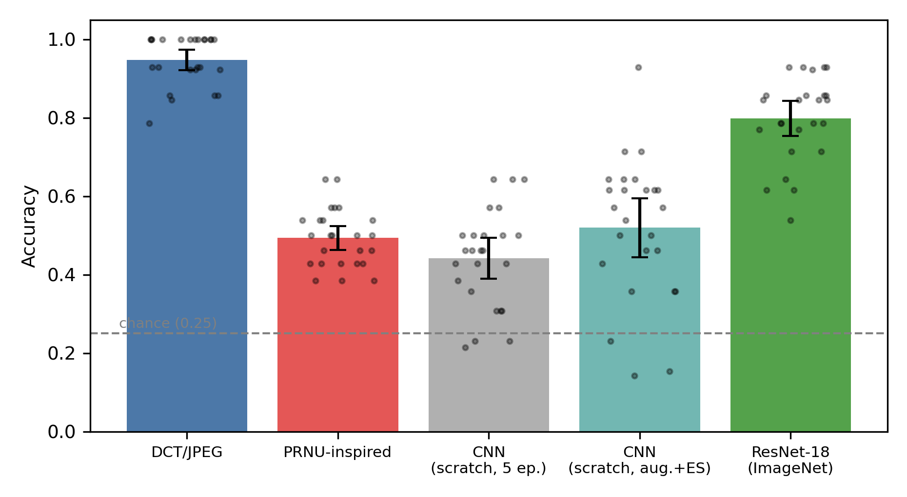

# edltauSCI — Evaluating Deep Learning and Traditional Approaches Used in Source Camera Identification

Code for the paper by **Mansur Ozaman** (Nazarbayev University), SIDe'26.

The study compares, on four smartphones (Xiaomi Redmi Note 10S, Samsung Galaxy S24,
iPhone 13 Pro Max, iPhone 17 Pro; 17 images each):

- **DCT/JPEG artifact features**: mean and variance of the 7×7 AC DCT coefficients of all 8×8 blocks, then PCA and an RBF-SVM
- **PRNU-inspired noise residuals**: a Wiener-style residual and a linear SVM
- **CNNs**: a compact CNN trained from scratch (5 epochs, or with augmentation and early stopping), and an ImageNet-pretrained ResNet-18 (fine-tuned)

All methods use the **same 25 folds** of repeated stratified 5-fold cross-validation. Every preprocessing step (standardisation, PCA, validation split) is fitted on the training folds only. Pairwise differences are tested with the corrected resampled t-test (Nadeau & Bengio) with Holm adjustment. Two control experiments measure the effect of the JPEG/HEIC native-format difference: same-format device pairs, and re-encoding every image with a common JPEG encoder.

## Results (mean accuracy over 25 folds, 95% CI)

| Method | Accuracy |
|---|---|
| DCT/JPEG artifact features | 0.947 [0.921, 0.974] |
| ResNet-18 (ImageNet, fine-tuned) | 0.799 [0.754, 0.844] |
| Compact CNN, augmentation + early stopping | 0.520 [0.445, 0.595] |
| PRNU-inspired residual features | 0.493 [0.463, 0.524] |
| Compact CNN, 5 epochs | 0.442 [0.390, 0.494] |



## Data

Download the dataset from Zenodo: https://zenodo.org/records/17640511. Place it as `data/<device>/` (`iphone13promax`, `iphone17pro`, `redminote10s`, `samsungs24`), or set `SCI_DATA=/path/to/data`.

## Reproduce

```
pip install -r requirements.txt
python3 src/extract_features.py          # features + resized images -> cache/
python3 src/run_traditional.py           # DCT/JPEG, PRNU, format controls -> results/traditional.json
python3 src/run_cnn.py scratch_orig      # compact CNN, 5 epochs
python3 src/run_cnn.py scratch_improved  # compact CNN, augmentation + early stopping
python3 src/run_cnn.py resnet18          # ImageNet-pretrained ResNet-18
python3 src/run_cnn.py collect           # -> results/cnn_all.json
python3 src/analyze.py                   # statistics + figures -> results/final.json, figures/
```

Everything runs on CPU. The scripts can be resumed: `extract_features.py` and `run_cnn.py` accept an optional time budget and skip work that is already finished. `src/folds.json` fixes the 25 folds and the validation splits used for early stopping.

## Layout

| Path | Contents |
|---|---|
| `src/` | the four pipeline scripts and `folds.json` |
| `results/` | `traditional.json`, `cnn/` (one file per model and fold), `cnn_all.json`, `final.json` (all reported statistics) |
| `figures/` | figures used in the paper |
